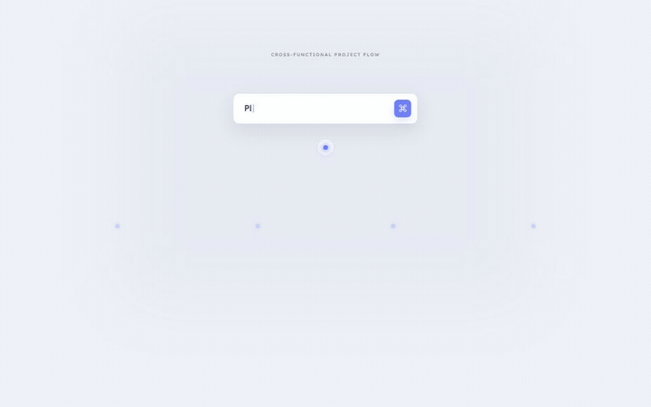

<p align="center">
  
</p>

# Stagecut

Stagecut is a high-performance React runtime for playing deterministic DOM animations in web pages. Projects are portable JSON; React surface components provide the visuals; a compiled scene timeline keeps playback work bounded.

Stagecut is designed for browser playback. It does not export MP4/WebM, manage audio, or provide a visual editor.

## Features

- Serializable Project → Stage → Video → Scene → Layer model
- Parallel layers inside sequential scenes
- Fade, slide, zoom, and wipe scene transitions
- Runtime validation with structured field paths
- O(log n) active-scene lookup and a two-scene render window
- React 18/19 and SSR-safe player mounting
- Remotion-powered playback behind a Stagecut-owned controller API

## Install

```bash
pnpm add @stagecut/core @stagecut/react react react-dom
```

`@stagecut/react` uses Remotion internally. Review [Remotion licensing](docs/remotion-license.md) and explicitly acknowledge it on the player when appropriate.

## Quick start

```tsx
import { compileStagecutVideo, defineStagecutProject } from "@stagecut/core";
import { defineSurfaceRegistry, StagecutPlayer } from "@stagecut/react";

const project = defineStagecutProject({
  schemaVersion: 1,
  id: "hello-project",
  name: "Hello Project",
  stages: [{ id: "main", name: "Main", width: 1280, height: 720, background: "#101827" }],
  surfaces: [{ id: "title", name: "Title" }],
  videos: [{
    id: "hello",
    name: "Hello",
    stageId: "main",
    fps: 60,
    scenes: [{
      id: "intro",
      durationInFrames: 120,
      layers: [{ id: "title", surfaceId: "title", inputProps: { text: "Hello Stagecut" } }],
    }],
  }],
});

const surfaces = defineSurfaceRegistry(project, {
  title: ({ input, context }) => (
    <h1 style={{ opacity: context.progress }}>{input.text}</h1>
  ),
});

const video = compileStagecutVideo(project, "hello");

export function Preview() {
  return <StagecutPlayer acknowledgeRemotionLicense surfaces={surfaces} video={video} />;
}
```

Surface components receive `{ input, context }`. Input is JSON data from the layer; context contains `globalFrame`, `localFrame`, `progress`, `fps`, `sceneId`, and `layerId`. Surface interaction is disabled by default so playback stays deterministic. Pass `interactive` to `StagecutPlayer` when a browser experience should expose the real buttons, links, inputs, selection, and focus behavior rendered by a surface. Only the active scene accepts pointer events during a transition.

## External JSON

Use `parseStagecutProject(unknown)` for external data. Validation failures throw `StagecutValidationError` with an `issues` array containing `path`, `code`, and `message`. Use `safeParseStagecutProject()` when a discriminated result is more convenient. `serializeStagecutProject()` produces canonical formatted JSON.

## Gallery

Explore the [live production gallery](https://hugozhou-ai.github.io/stage-cut/), or run it locally:

```bash
corepack enable
pnpm install
pnpm dev
```

Open the URL printed by Vite. The gallery contains three production-style cases built with Stagecut's public API.

### Cross-functional Task Flow

[](docs/assets/gallery/task-flow.mp4)

### Project Activity Cluster

[](docs/assets/gallery/message-cluster.mp4)

### Application Creation Dialog

[](docs/assets/gallery/application-dialog.mp4)

Click an animation to open its MP4. Regenerate all gallery media with `pnpm gallery:render`; the command requires FFmpeg on `PATH`.

The server starts at port `5173` and advances when the port is busy. Override it with `STAGECUT_GALLERY_PORT` and `STAGECUT_GALLERY_HOST`. The previous `STAGECUT_STUDIO_PORT` and `STAGECUT_STUDIO_HOST` names remain accepted during the Gallery rename.

## Verification

```bash
pnpm verify
pnpm test:coverage
```

See [architecture](docs/architecture.md), [performance](docs/performance.md), and the [0.1 migration guide](docs/migration-0.1.md).

Maintainers should follow [RELEASING.md](RELEASING.md); publishing is manually approved and never runs automatically on a branch push.

## Contributing and security

Read [CONTRIBUTING.md](CONTRIBUTING.md) before opening a pull request. Report vulnerabilities through the process in [SECURITY.md](SECURITY.md).

Stagecut is available under the [MIT License](LICENSE).
