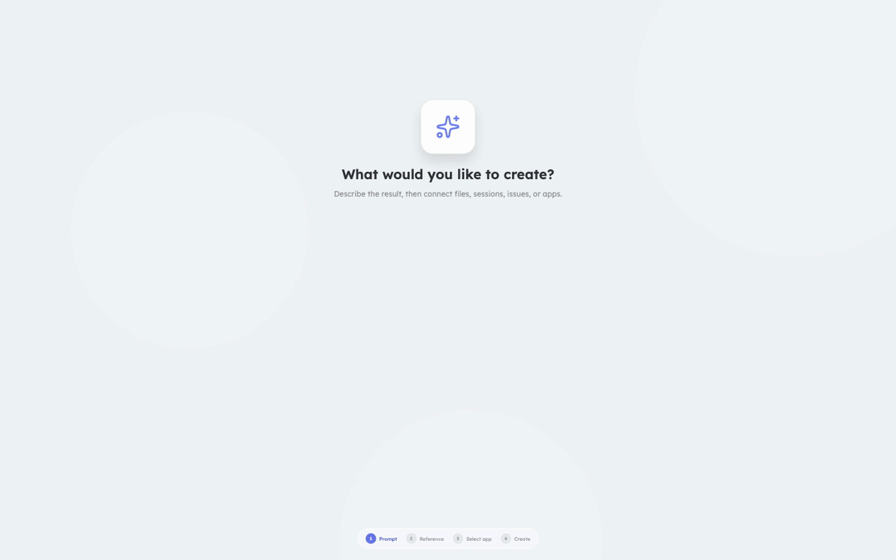

<p align="center">
  <a href="https://hugozhou-ai.github.io/stage-cut/">
    
  </a>
</p>

# StageCut

[](README.md)

StageCut 是一个可交互、逐帧精确的动画引擎，用于构建和播放 DOM 视频体验。项目定义为便于移植的 JSON 格式；React Surface 组件负责渲染；编译后的场景时间表确保有界且可预测的播放性能。

StageCut 仅为浏览器播放设计，不提供 MP4/WebM 导出、音频管理或可视化编辑器。

> **生产环境实践：** [tutti.sh](https://tutti.sh/) —— 一个让人与 Agent *「同频」* 创造的地方 —— 其官网动画即基于 StageCut 构建。查看真实实现：[tutti-os/tutti](https://github.com/tutti-os/tutti)。

## 示例画廊

在本地安装或运行 StageCut 之前，可先浏览交互式生产级示例：**[打开在线生产级示例画廊 →](https://hugozhou-ai.github.io/stage-cut/)**

画廊包含三个基于 StageCut 公开 API 构建的生产级示例，改编自 tutti.sh 的真实界面。

### 演示案例：Application Creation Dialog

[](docs/assets/gallery/application-dialog.mp4)

点击动画可打开全分辨率 MP4。使用 `pnpm gallery:render` 重新生成画廊媒体；该命令要求系统 `PATH` 中已安装 FFmpeg。

本地运行同一画廊：

```bash
corepack enable
pnpm install
pnpm dev
```

打开 Vite 打印的 URL。服务默认监听 `5173` 端口，端口占用时自动递增。可通过 `STAGECUT_GALLERY_PORT` 和 `STAGECUT_GALLERY_HOST` 覆盖。Gallery 重命名期间，仍兼容旧的 `STAGECUT_STUDIO_PORT` 和 `STAGECUT_STUDIO_HOST` 环境变量名。

## 特性

- 可序列化的 Project → Stage → Video → Scene → Layer 数据模型
- 顺序场景内支持并行图层
- 淡入淡出、滑动、缩放、擦除等场景过渡效果
- 运行时验证及结构化字段路径报告
- O(log n) 活跃场景查询和双场景渲染窗口
- React 18/19 兼容，播放器挂载 SSR 安全
- 基于 Remotion 的播放能力，通过 StageCut 自有的控制器 API 封装

## 安装

```bash
pnpm add @stage-cut/core @stage-cut/react-player react react-dom
```

`@stage-cut/react-player` 内部使用 Remotion。请查阅 [Remotion 许可说明](docs/remotion-license.md)，并在适当时在播放器上显式确认许可。

## 快速开始

```tsx
import { compileStagecutVideo, defineStagecutProject } from "@stage-cut/core";
import { defineSurfaceRegistry, StagecutPlayer } from "@stage-cut/react-player";

const project = defineStagecutProject({
  schemaVersion: 1,
  id: "hello-project",
  name: "Hello Project",
  stages: [{ id: "main", name: "Main", width: 1280, height: 720, background: "#101827" }],
  surfaces: [{ id: "title", name: "Title" }],
  videos: [{
    id: "hello",
    name: "Hello",
    stageId: "main",
    fps: 60,
    scenes: [{
      id: "intro",
      durationInFrames: 120,
      layers: [{ id: "title", surfaceId: "title", inputProps: { text: "Hello StageCut" } }],
    }],
  }],
});

const surfaces = defineSurfaceRegistry(project, {
  title: ({ input, context }) => (
    <h1 style={{ opacity: context.progress }}>{input.text}</h1>
  ),
});

const video = compileStagecutVideo(project, "hello");

export function Preview() {
  return <StagecutPlayer acknowledgeRemotionLicense surfaces={surfaces} video={video} />;
}
```

Surface 组件接收 `{ input, context }`。`input` 为图层中的 JSON 数据；`context` 包含 `globalFrame`、`localFrame`、`progress`、`fps`、`sceneId` 和 `layerId`。默认禁用 Surface 交互以保证播放的确定性。当浏览器体验需要暴露 Surface 渲染的实际按钮、链接、输入框、选项选择和焦点行为时，向 `StagecutPlayer` 传入 `interactive` 属性。过渡期间仅活跃场景接受指针事件。

## 外部 JSON

对外部数据使用 `parseStagecutProject(unknown)`。校验失败时抛出 `StagecutValidationError`，其 `issues` 数组包含 `path`、`code` 和 `message`。若需要判别式结果，可使用 `safeParseStagecutProject()`。`serializeStagecutProject()` 输出规范格式的 JSON。

## StageCut Devtools

在运行时包旁安装开发专用的 Studio：

```bash
pnpm add -D @stage-cut/devtools
```

在应用根组件附近挂载一次。将 `enabled` 与主机环境的开发模式关联，以防止在生产环境中激活 Studio：

```tsx
import { StagecutDevtools } from "@stage-cut/devtools";

<StagecutDevtools
  acknowledgeRemotionLicense
  enabled={import.meta.env.DEV}
  project={project}
  surfaces={surfaces}
/>;
```

在 URL 中添加 `?stagecut` 以显示全局启动器。它会在新标签页打开 `?stagecut=studio`，你可以预览真实的 Surface 组件，编辑场景、过渡、图层和 input 属性，检查运行时帧状态，并将修改结果作为 Agent Prompt 复制。草稿仅保存在当前标签页的 `sessionStorage` 中，永远不会直接修改源文件。

## 验证

```bash
pnpm verify
pnpm test:coverage
```

请参阅 [架构说明](docs/architecture.md)、[性能说明](docs/performance.md) 和 [0.1 迁移指南](docs/migration-0.1.md)。面向开发者和编码 Agent 的任务导向参考，请查阅 [AI 友好项目使用指南](docs/ai-usage-guide.md)。

维护者请参阅 [RELEASING.md](RELEASING.md)；发布需要手动批准，不会在分支推送时自动执行。

## 贡献与安全

提交 Pull Request 前请阅读 [CONTRIBUTING.md](CONTRIBUTING.md)。安全漏洞请按 [SECURITY.md](SECURITY.md) 中的流程报告。

StageCut 以 [MIT License](LICENSE) 开源。
